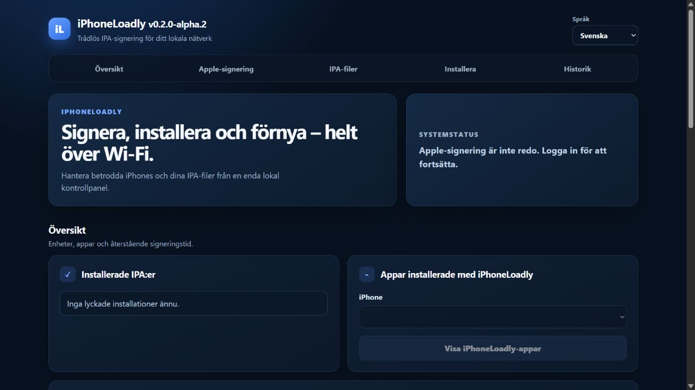
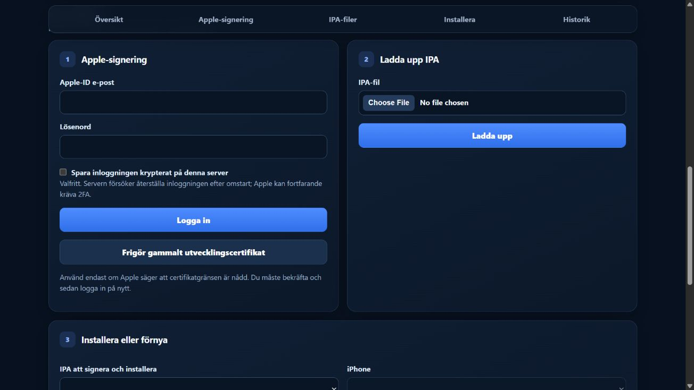
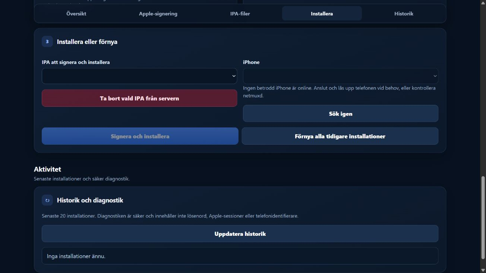
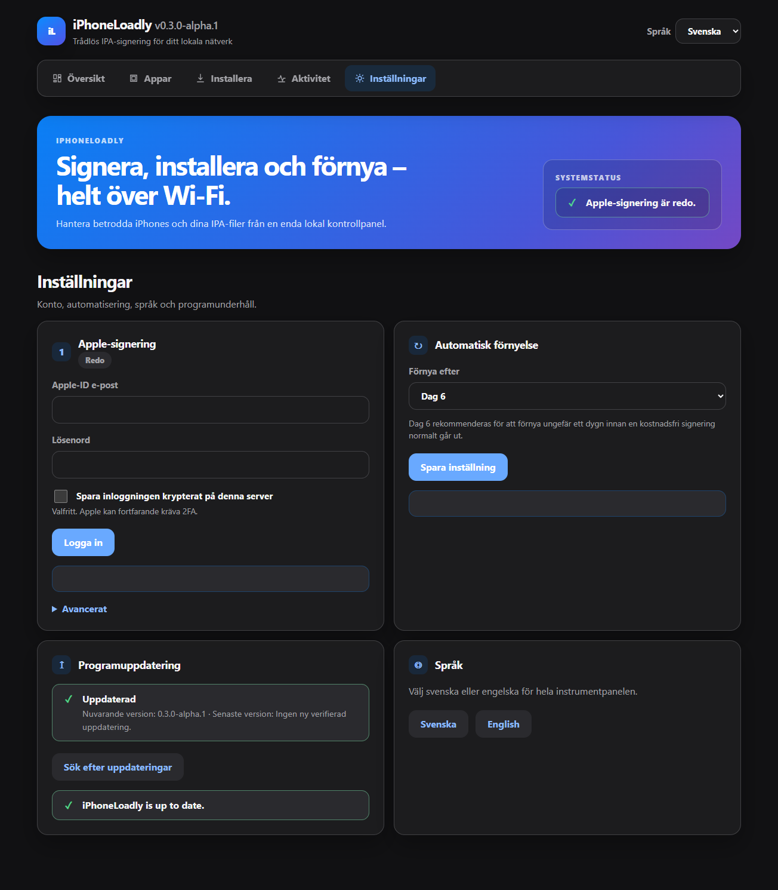

# iPhoneLoadly user guide

This guide covers the normal workflow after the server, Caddy, and the initial
USB pairing have been configured. The dashboard is normally available at:

```text
https://iphoneloadly.local
```

A certificate warning may appear because Caddy uses a local certificate
authority. On a network you trust, you can continue past the browser warning or
install Caddy's public root certificate by following the
[Caddy LAN guide](operations/caddy-lan.md). Never expose the dashboard directly
to the Internet.

## 1. Navigate the dashboard



The top navigation links lead to **Overview**, **Apple signing**,
**IPA files**, **Install**, and **History**. Use the language selector to switch
the complete interface between English and Swedish.

The system status reports whether Apple signing and Wi-Fi discovery are ready.
The overview shows successful installations, remaining signing time, trusted
iPhones, and only the apps installed through iPhoneLoadly.

## 2. Sign in with Apple



1. Enter the Apple ID email address and password under **Apple signing**.
2. Select **Save credentials encrypted on this server** only if you want the
   server to attempt to restore the session after a restart.
3. Select **Sign in** and enter the Apple 2FA code when prompted.
4. Confirm that the system status reports that Apple signing is ready.

The password remains in memory only unless encrypted storage is explicitly
enabled. Two-factor authentication codes are never stored. Apple may still
require a new code after a server restart.

Use **Release an old development certificate** only if Apple explicitly
reports that the certificate limit has been reached. Revoking a certificate
can make previously signed apps unavailable until they are signed again.

## 3. Upload an IPA

1. Select **Choose File** under **Upload IPA**.
2. Choose an `.ipa` file from the computer.
3. Select **Upload** and wait for confirmation.
4. The uploaded file becomes available under **Install or refresh**.

Use **Delete selected IPA from server** to remove an uploaded IPA. Deletion is
permanent and is blocked while the file is being used by an active installation
or refresh job.

## 4. Install on a trusted iPhone



1. Confirm that the iPhone is paired, reachable, and connected to the same
   LAN/Wi-Fi network as the server.
2. Choose the IPA under **IPA to sign and install**.
3. Choose the phone under **iPhone**.
4. Select **Sign and install**.
5. Follow the progress bar through signing, transfer, and installation.

The phone may need to be unlocked. If it does not appear, select **Scan again**.
If it remains offline, check Wi-Fi, `iphoneloadly-netmuxd`, and Bonjour.

## 5. Choose the automatic refresh day



1. Open **Overview → Automatic refresh**.
2. Choose day 1–6 after the latest successful installation.
3. Select **Save setting**.

Day 6 is the default and recommended value because it normally leaves about
one day before a free seven-day signing expires. The setting is stored in the
server database and survives restarts. The timer checks hourly and retries
later if the phone is offline. Automatic refresh requires Apple signing to be
ready.

**Refresh all previous installations** uses the selected day and queues every
installation that has reached the configured threshold.

## 6. Check validity and history

**Installed IPAs** shows the number of remaining days for each successful
installation. Select a phone and use **Show iPhoneLoadly apps** to list only
apps installed by this service; regular App Store apps are not included.

**History and diagnostics** shows the latest 20 jobs, their status, progress,
and safely redacted diagnostics. It never displays passwords, Apple sessions,
or complete phone identifiers.

## Troubleshooting

- [Installation and common troubleshooting](INSTALL.md#troubleshooting)
- [Caddy and LAN access](operations/caddy-lan.md)
- [Debian, Bonjour, and Wi-Fi](operations/debian13-host-preparation.md)
- [Systemd, refresh, backup, and recovery](operations/api-systemd.md)

## GitHub IPA sources

The **GitHub IPA sources** section accepts only a public `owner/repo` or
canonical `https://github.com/owner/repo` repository. Preview the latest
eligible release, choose a filename pattern such as `*.ipa`, and save the
source. The pattern must match exactly one IPA asset; ambiguous releases are
never guessed.

Use **Check latest** and **Download latest** for manual updates. A downloaded
IPA is validated like a browser upload. When linked to an existing app, its
bundle identifier must match and the logical app ID and history remain stable.
Downloading does not install the IPA on the phone.

Automatic downloads are off by default. Read the security information before
acknowledging the risk. Repository, pattern, or prerelease changes disable the
acknowledgement. Automatic sync updates the server copy only; an enabled
automatic refresh may use that copy later.

## Removing stale management entries

Under **Managed installations**, choose **Remove from management** to stop
tracking and refreshing an app/device pair that was deleted manually from the
iPhone. This action does not uninstall anything from the phone, delete the
server IPA, or delete history. A later successful installation restores
management automatically.

## Official updates

Alpha.3 is the bootstrap release for in-dashboard official updates. After
installing alpha.3 once using the verified package method, the dashboard can
check the official `lemehavit/iPhoneLoadly` release and request a verified
update. Configuration, pairing, signing state, uploaded IPAs and Caddy state
are preserved.
